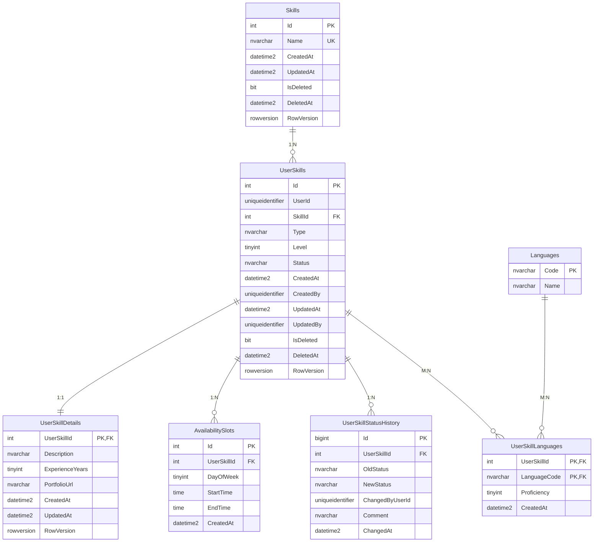
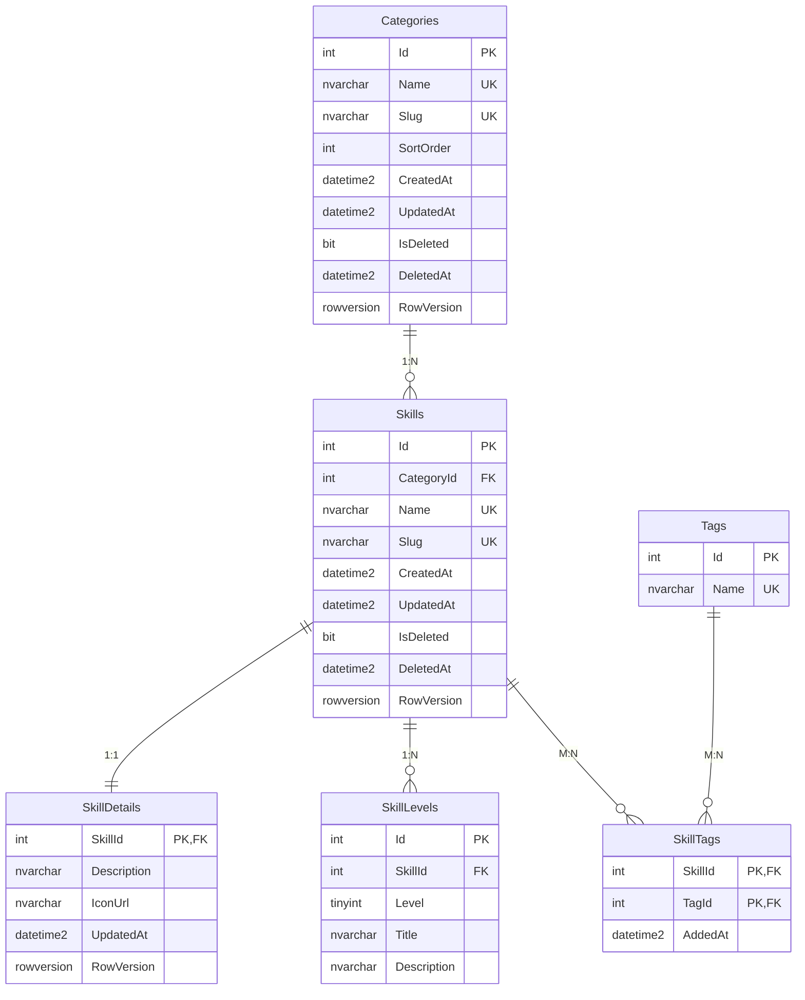

# QPQ (Quid pro quo)

Платформа обміну навичками: користувачі пропонують свої навички та домовляються про обмін з іншими.

## Предметна область і контексти

Домен розбито на три піддомени, у кожному по три API. Кожен API має власну базу даних.

| Піддомен | API |
|---|---|
| Skills | Catalog, UserSkills, Matching |
| Swaps | Swaps, Sessions, Messages |
| Reviews | Reviews, Reputation, Moderation |

Персональні дані (ім'я, email, аватар) зберігає зовнішній сервіс Identity (Duende IdentityServer / Keycloak). Він видає `UserId` (claim `sub`), а доменні сервіси зберігають лише цей ідентифікатор.

### Піддомен Swaps: три незалежні контексти

| Контекст | Сховище | База | Сутності, якими він володіє |
|---|---|---|---|
| Swaps (Проєкт №1) | SQL Server, ADO.NET + Dapper | `QPQ_Swaps` | Swap, SwapDetails, SwapSkill, SwapStatusHistory |
| Sessions (Проєкт №2) | SQL Server, EF Core | `QPQ_Sessions` | Session, SessionSkill, SessionOutcome, SessionFormat (довідник) |
| Messages (Проєкт №3) | MongoDB | `QPQ_Messages` | conversations, messages, attachments |

Кожна сутність належить рівно одному контексту. Таблиці `Skills` (у Swaps і Sessions), `AcceptedSwaps` (у Sessions) та колекція `conversations` (частково) є лише локальними копіями чужих даних, їх власник вказаний у політиці дублювання. Між базами немає FOREIGN KEY і спільних таблиць: зв'язок забезпечується ідентифікаторами та подіями.

## Політика дублювання даних

| Дані | Власник | Де зберігається копія | Що дублюється | Як підтримується узгодженість |
|---|---|---|---|---|
| Користувачі | Identity | ніде не дублюються | лише `UserId` (GUID) у полях `InitiatorId`, `PartnerId`, `CreatedBy`, `UpdatedBy`, `ChangedByUserId`, `CreatedByUserId`, `senderId`, `uploadedBy`, `participants.userId` | ім'я для відображення береться з токена або з Identity; подія `UserDeleted` очищає дані користувача |
| Навички | Catalog | Swaps (`Skills`) | `Id`, `Name` | подія `SkillChanged` оновлює локальну копію |
| Навички | Catalog | Sessions (`Skills`) | `Id`, `Name` | подія `SkillChanged` оновлює локальну копію |
| Прийнятий обмін | Swaps | Sessions (`AcceptedSwaps`) | `SwapId`, `InitiatorId`, `PartnerId`, `Status` | події `SwapAccepted` (створює копію) і `SwapCompleted` (оновлює статус) |
| Прийнятий обмін | Swaps | Messages (`conversations`) | `swapId`, `swapStatus`, `participants` (`userId`, `role`) | події `SwapAccepted` (створює розмову) і `SwapCompleted` (оновлює `swapStatus`) |
| Останнє повідомлення | Messages (`messages`) | Messages (`conversations.lastMessage`) | `messageId`, `senderId`, `preview`, `sentAt` | оновлюється разом із додаванням нового повідомлення |
| Назва вкладення | Messages (`attachments`) | Messages (`messages.attachments[].fileName`) | `fileName` | задається під час створення повідомлення, назва вкладення не змінюється |

## Розгортання баз даних

Вимоги: SQL Server LocalDB (входить до Visual Studio), `sqlcmd`, MongoDB та `mongosh`.

### Проєкт №1 (Swaps)

Скрипти запускають у такому порядку, кожен можна виконувати повторно:

1. `db/p1/schema.sql`: створює базу `QPQ_Swaps`, таблиці, обмеження та індекси;
2. `db/p1/procedures.sql`: створює 5 збережуваних процедур;
3. `db/p1/seed.sql`: додає тестові дані (повторний запуск не створює дублікатів).

```
sqlcmd -S "(localdb)\MSSQLLocalDB" -E -i db\p1\schema.sql
sqlcmd -S "(localdb)\MSSQLLocalDB" -E -i db\p1\procedures.sql
sqlcmd -S "(localdb)\MSSQLLocalDB" -E -i db\p1\seed.sql
```

### Проєкт №2 (Sessions)

1. `db/p2/schema.sql`: створює базу `QPQ_Sessions`, таблиці, обмеження та індекси;
2. `db/p2/seed.sql`: додає довідник форматів і тестові дані (повторний запуск не створює дублікатів).

```
sqlcmd -S "(localdb)\MSSQLLocalDB" -E -i db\p2\schema.sql
sqlcmd -S "(localdb)\MSSQLLocalDB" -E -i db\p2\seed.sql
```

### Проєкт №3 (Messages, MongoDB)

1. `db/p3/collections.js`: створює колекції з валідацією `$jsonSchema` та індекси в базі `QPQ_Messages`;
2. `db/p3/seed.js`: додає тестові дані (повторний запуск не створює дублікатів).

```
mongosh db\p3\collections.js
mongosh db\p3\seed.js
```

## Структура контекстів

ERD: [docs/erd-swaps.md](docs/erd-swaps.md). Опис контекстів: [docs/contexts.md](docs/contexts.md). Приклади документів MongoDB: [docs/document-examples.md](docs/document-examples.md).

### Swaps (`QPQ_Swaps`)

| Таблиця | Призначення | Зв'язок |
|---|---|---|
| Skills | локальна копія навичок з Catalog | M:N зі Swaps через SwapSkills |
| Swaps | заявка на обмін (`InitiatorId`, `PartnerId`, `Status`) | головна сутність |
| SwapDetails | деталі заявки | 1:1 зі Swaps |
| SwapSkills | навички заявки з роллю Offered/Requested | M:N з власним полем `Role` |
| SwapStatusHistory | журнал змін статусу | 1:N до Swaps |

Таблиця `Swaps` має аудитні колонки `CreatedAt`, `CreatedBy`, `UpdatedAt`, `UpdatedBy`, м'яке видалення (`IsDeleted`, `DeletedAt`) та `RowVersion` для оптимістичної конкурентності. Решта таблиць мають `CreatedAt`, а там, де можливе паралельне редагування, `UpdatedAt` і `RowVersion`.

#### Обмеження

| Тип | Приклади |
|---|---|
| PK | `Swaps.Id`, `SwapDetails.SwapId`, складений `SwapSkills (SwapId, SkillId, Role)` |
| FK | `SwapDetails → Swaps`, `SwapSkills → Swaps` і `→ Skills`, `SwapStatusHistory → Swaps` |
| UNIQUE | `UX_Skills_Name`: назва навички не повторюється серед активних |
| CHECK | допустимі статуси, `InitiatorId <> PartnerId`, роль `Offered/Requested`, `DurationMinutes > 0` |
| DEFAULT | `Status = 'Pending'`, `CreatedAt = SYSUTCDATETIME()`, `IsDeleted = 0` |

Каскадного видалення немає: усі FK мають `NO ACTION`. Обміни видаляються м'яко (`IsDeleted`), тому фізичне видалення не використовується, а історія статусів не повинна зникати разом із заявкою.

#### Індекси

| Індекс | Під який запит створено |
|---|---|
| `IX_Swaps_Initiator_Status` | `usp_GetUserSwaps` для ролі Initiator: відбір за `InitiatorId` і `Status`, сортування за `CreatedAt` (колонка в `INCLUDE`), лише активні записи |
| `IX_Swaps_Partner_Status` | те саме для ролі Partner |
| `IX_SwapSkills_Skill` | пошук обмінів за навичкою та перевірка FK під час оновлення навичок |
| `IX_SwapStatusHistory_Swap` | вибірка історії статусів конкретного обміну в хронологічному порядку |
| `UX_Skills_Name` | унікальність назв і пошук навички за назвою |

#### Збережувані процедури

| Процедура | Призначення |
|---|---|
| `usp_CreateSwap` | створення заявки в одній транзакції (Swaps, SwapDetails, SwapSkills, історія) |
| `usp_ChangeSwapStatus` | транзакційна зміна статусу з перевіркою прав, дозволених переходів і RowVersion; недопустимий перехід дає помилку 50012 |
| `usp_GetSwapById` | заявка з деталями та навичками |
| `usp_GetUserSwaps` | заявки користувача з фільтрами та пагінацією |
| `usp_SoftDeleteSwap` | м'яке видалення з перевіркою RowVersion |

Статуси: Pending, Accepted, Completed, Rejected, Cancelled.

### Sessions (`QPQ_Sessions`)

| Таблиця | Призначення | Зв'язок |
|---|---|---|
| SessionFormats | довідник форматів (Online, InPerson) | 1:N до Sessions |
| AcceptedSwaps | локальна копія прийнятих обмінів | 1:N до Sessions |
| Sessions | зустрічі в межах обміну | головна сутність |
| SessionOutcomes | підсумок проведеної зустрічі | 1:1 із Sessions |
| Skills | локальна копія навичок з Catalog | M:N із Sessions через SessionSkills |
| SessionSkills | навички, які розглядають на зустрічі, з полем `PlannedMinutes` | M:N з власним полем |

Довідник `SessionFormats` заповнюється в `seed.sql`. Статуси зустрічі: Planned, Completed, Cancelled.

#### Обмеження та індекси

| Тип | Приклади |
|---|---|
| UNIQUE | `UQ_SessionFormats_Code`, `UX_Skills_Name`, `UX_Sessions_Swap_Time` (не можна призначити дві зустрічі на один обмін в один час) |
| CHECK | `DurationMinutes > 0`, `PlannedMinutes > 0`, допустимі статуси, `CK_Sessions_Place` (для Online потрібне посилання, для InPerson місце) |
| DEFAULT | `Status = 'Planned'`, `DurationMinutes = 60`, `PlannedMinutes = 30` |
| Каскади | `NO ACTION` у всіх FK, зустрічі видаляються м'яко |

| Індекс | Під який запит створено |
|---|---|
| `IX_AcceptedSwaps_Initiator`, `IX_AcceptedSwaps_Partner` | пошук обмінів користувача для перевірки прав доступу до зустрічей |
| `IX_Sessions_Swap_ScheduledAt` | перелік зустрічей обміну за часом, лише активні |
| `UX_Sessions_Swap_Time` | заборона дублювання часу зустрічі в межах обміну |
| `IX_SessionSkills_Skill` | пошук зустрічей за навичкою |

### Messages (`QPQ_Messages`)

| Колекція | Призначення | Підхід |
|---|---|---|
| conversations | розмова за прийнятим обміном | вбудовані `participants` (масив піддокументів) і `lastMessage` (гібрид: знімок посилання); посилання на обмін через `swapId`; денормалізоване `swapStatus` |
| messages | повідомлення розмови | посилання на `conversationId`; три типи документів із різними наборами полів: `text`, `file`, `system` |
| attachments | файли розмови | окрема колекція, на яку посилаються повідомлення типу `file` через `attachments[].attachmentId` |

У повідомленнях типу `file` вкладення зберігаються гібридно: посилання `attachmentId` плюс вбудована назва `fileName`. Структуру документів перевіряє `$jsonSchema` (для `messages` через `oneOf` за типом): формат GUID, допустимі статуси та події, довжина тексту, не більше десяти вкладень.

| Індекс | Під який запит створено |
|---|---|
| `ux_conversations_swap` (унікальний) | одна розмова на обмін, пошук розмови за `swapId` |
| `ix_conversations_participant` | список розмов користувача |
| `ix_messages_conversation_createdAt` | хронологічна стрічка повідомлень розмови, без видалених |
| `ix_messages_sender_createdAt` | повідомлення конкретного відправника |
| `ix_attachments_conversation_uploadedAt` | файли розмови від нових до старих |

---

## QPQ (Quid pro quo): піддомен Skills

Платформа обміну навичками: користувачі пропонують свої навички та домовляються про обмін з іншими. Піддомен Skills відповідає за те, які навички існують, хто що пропонує чи хоче вивчити і хто кому підходить для обміну.

### Предметна область і контексти

Великий домен розбито на три піддомени, у кожному по три API. Кожен API має власну базу даних. Потік даних: Skills → Swaps → Reviews. Цей репозиторій містить реалізацію баз піддомену Skills.

| Піддомен | API |
|---|---|
| Skills | Catalog, UserSkills, Matching |
| Swaps | Swaps, Sessions, Messages |
| Reviews | Reviews, Reputation, Moderation |

Персональні дані (ім'я, email, аватар) зберігає зовнішній сервіс Identity (Duende IdentityServer / Keycloak). Він видає `UserId` (claim `sub`), а доменні сервіси зберігають лише цей ідентифікатор.

#### Піддомен Skills: три незалежні контексти

| Контекст | Сховище | База | Сутності, якими він володіє |
|---|---|---|---|
| UserSkills (Проєкт №1) | SQL Server, ADO.NET + Dapper | `QPQ_UserSkills` | UserSkill, UserSkillDetail, AvailabilitySlot, UserSkillLanguage, UserSkillStatusHistory, Language (довідник) |
| Catalog (Проєкт №2) | SQL Server, EF Core | `QPQ_Catalog` | Category, Skill, SkillDetail, SkillLevel, Tag, SkillTag |
| Matching (Проєкт №3) | MongoDB | `QPQ_Matching` | userSkillIndex, matches, skillStats |

Вибір сховища: UserSkills має життєвий цикл записів (Active, Paused, Archived) із контрольованими переходами, тому йому потрібні транзакційні процедури (Dapper). Catalog має багато сутностей і зв'язків різних типів, зручних для EF Core (Code First, міграції). Matching є read-моделлю з вкладеними масивами та документами різної форми, тому йому підходить MongoDB.

Кожна сутність належить рівно одному контексту. Таблиця `Skills` у UserSkills та колекції `userSkillIndex` (копія записів UserSkills; `skillName` з Catalog) і `skillStats` (похідні лічильники) є лише локальними копіями чужих даних; їх власники вказані в політиці дублювання. Між базами немає FOREIGN KEY і спільних таблиць: зв'язок забезпечується ідентифікаторами та подіями.

Навички `SkillId` 1-6 мають однакові ідентифікатори в усіх базах QPQ (Skills, Sessions та Swaps використовують ті самі seed-довідники), так само як користувачі U1-U4 в усіх seed-скриптах.

### Політика дублювання даних

| Дані | Власник | Де зберігається копія | Що дублюється | Як підтримується узгодженість |
|---|---|---|---|---|
| Користувачі | Identity | ніде не дублюються | лише `UserId` (GUID) у полях `UserSkills.UserId`, `CreatedBy`, `UpdatedBy`, `ChangedByUserId`, `userSkillIndex.userId`, `matches.userIds`, `offer.fromUserId`, `offer.toUserId` | ім'я для відображення береться з токена або з Identity; подія `UserDeleted` очищає дані користувача (UserSkills м'яко видаляє записи, Matching видаляє документи) |
| Навички | Catalog | UserSkills (`Skills`) | `Id`, `Name` | подія `SkillChanged` оновлює локальну копію |
| Навички | Catalog | Matching (`userSkillIndex.skillName`, `skillStats.skillName`) | `skillName` | подія `SkillChanged` оновлює назву в усіх документах навички |
| Навички | Catalog | Matching (`matches.offer.skillName`, `counterOffer.skillName`) | `skillName` | знімок на момент підбору, не оновлюється: пари тимчасові (TTL `expiresAt`) |
| Навичка користувача | UserSkills | Matching (`userSkillIndex`) | `userSkillId`, `userId`, `skillId`, `type`, `level`, `status`, `languages` (`code`, `proficiency`), `availability`, `experienceYears` (лише Offer) | подія `UserSkillsChanged` створює, оновлює або видаляє документ; після неї перераховуються пари й `skillStats` |
| Рівень навички | Catalog (`SkillLevels`) | UserSkills (`UserSkills.Level`), Matching (`level`) | число 1..5 | єдина шкала 1..5 є контрактом між контекстами; назви рівнів беруться з Catalog і в інших базах не зберігаються |
| Мови | UserSkills (`Languages`) | Matching (`languages[].code`) | лише код мови | коди змінюються рідко; нові приходять із `UserSkillsChanged` |
| Лічильники навички | Matching (`userSkillIndex`) | Matching (`skillStats`) | `offersCount`, `wantsCount`, `topLanguages` | похідні дані, перераховуються агрегацією з `$merge` (запит 8 у `db/p3/matching.queries.js`) |
| Посилання на запис індексу | Matching (`userSkillIndex`) | Matching (`matches.offer.indexRef`) | посилання на запис індексу | посилання за `_id`, дані читаються через `$lookup` (запит 6) |

#### Події між сервісами

| Подія | Від | Кому | Навіщо |
|---|---|---|---|
| `UserRegistered` / `UserDeleted` | Identity | UserSkills, Matching | створити або очистити дані користувача |
| `SkillChanged` | Catalog | UserSkills, Matching | актуальні назви навичок |
| `UserSkillsChanged` | UserSkills | Matching | оновити підбір пар |

### Розгортання баз даних

Вимоги: SQL Server LocalDB (входить до Visual Studio), `sqlcmd`, MongoDB 5.2 або новіша та `mongosh`.

#### Проєкт №1 (UserSkills)

Скрипти запускають у такому порядку, кожен можна виконувати повторно:

1. `db/p1/userskills.schema.sql`: створює базу `QPQ_UserSkills`, таблиці, типи для табличних параметрів, обмеження та індекси;
2. `db/p1/userskills.procedures.sql`: створює 6 збережуваних процедур;
3. `db/p1/userskills.seed.sql`: додає тестові дані (повторний запуск не створює дублікатів);
4. `db/p1/userskills.checks.sql` (за бажанням): перевірочні запити, див. розділ «Перевірка».

```
sqlcmd -S "(localdb)\MSSQLLocalDB" -E -i db\p1\userskills.schema.sql
sqlcmd -S "(localdb)\MSSQLLocalDB" -E -i db\p1\userskills.procedures.sql
sqlcmd -S "(localdb)\MSSQLLocalDB" -E -i db\p1\userskills.seed.sql
```

#### Проєкт №2 (Catalog)

1. `db/p2/catalog.schema.sql`: створює базу `QPQ_Catalog`, таблиці, обмеження та індекси;
2. `db/p2/catalog.seed.sql`: додає категорії, навички, рівні, теги та зв'язки між ними (повторний запуск не створює дублікатів).

```
sqlcmd -S "(localdb)\MSSQLLocalDB" -E -i db\p2\catalog.schema.sql
sqlcmd -S "(localdb)\MSSQLLocalDB" -E -i db\p2\catalog.seed.sql
```

#### Проєкт №3 (Matching, MongoDB)

1. `db/p3/matching.collections.js`: створює колекції з валідацією `$jsonSchema` та індекси в базі `QPQ_Matching`;
2. `db/p3/matching.seed.js`: додає тестові дані (повторний запуск не створює дублікатів).

```
mongosh db\p3\matching.collections.js
mongosh db\p3\matching.seed.js
```

#### Перевірка

Після розгортання можна перевірити вимоги лабораторної:

```
sqlcmd -S "(localdb)\MSSQLLocalDB" -E -i db\p1\userskills.checks.sql
sqlcmd -S "(localdb)\MSSQLLocalDB" -E -i db\p2\catalog.checks.sql
mongosh db\p3\matching.queries.js
```

`db/p1/userskills.checks.sql` і `db/p2/catalog.checks.sql` виводять усі зовнішні ключі бази (усі посилання лише на таблиці своєї бази), індекси та CHECK-обмеження. `db/p1/userskills.checks.sql` також викликає процедури зі свідомо неправильними даними: недопустимий перехід статусу, користувач без прав, застаріла `RowVersion`, дубль живого запису (кожна ситуація завершується керованою помилкою), показує CRUD, пошук із пагінацією та порівнює кількість рядків після повторного запуску seed. Сценарії, що змінюють дані, виконуються в транзакції з `ROLLBACK`.

`db/p3/matching.queries.js` показує, що документи `userSkillIndex` мають різні набори полів, пошук за вбудованими масивами, підбір взаємних пар, пагінацію, агрегації (`$group`, `$lookup`, `$merge`) і відхилення неправильного документа валідацією `$jsonSchema`.

### Структура контекстів

ERD: [docs/skills-erd.md](docs/skills-erd.md). Опис контекстів: [docs/skills-contexts.md](docs/skills-contexts.md). Приклади документів MongoDB: [docs/skills-document-examples.md](docs/skills-document-examples.md).

#### UserSkills (`QPQ_UserSkills`)

| Таблиця | Призначення | Зв'язок |
|---|---|---|
| Skills | локальна копія навичок з Catalog | 1:N до UserSkills |
| Languages | довідник мов | M:N з UserSkills через UserSkillLanguages |
| UserSkills | навичка користувача (`UserId`, `Type` Offer/Want, `Level`, `Status`) | головна сутність |
| UserSkillDetails | опис, досвід, портфоліо | 1:1 з UserSkills |
| AvailabilitySlots | вікна доступності за днями тижня | 1:N до UserSkills |
| UserSkillLanguages | мови навчання з рівнем володіння | M:N з власним полем `Proficiency` |
| UserSkillStatusHistory | журнал змін статусу | 1:N до UserSkills |

##### ERD



Таблиця `UserSkills` має аудитні колонки `CreatedAt`, `CreatedBy`, `UpdatedAt`, `UpdatedBy`, м'яке видалення (`IsDeleted`, `DeletedAt`) та `RowVersion` для оптимістичної конкурентності. Решта таблиць мають `CreatedAt`, а там, де можливе паралельне редагування (`UserSkillDetails`), ще `UpdatedAt` і `RowVersion`.

##### Первинні ключі та конкурентність

| Ключ | Тип | Обґрунтування |
|---|---|---|
| `UserSkills.Id` | `INT IDENTITY` | записи створює один сервіс через `usp_AddUserSkill`, тож ключ можна видати на стороні бази; послідовна вставка не фрагментує кластеризований індекс, вузький ключ робить компактними FK у чотирьох дочірніх таблицях; діапазону `INT` достатньо |
| `UserSkillStatusHistory.Id` | `BIGINT IDENTITY` | журнал росте швидше за самі записи (кілька рядків на кожен), тому з запасом |
| `Skills.Id` | `INT` без `IDENTITY` | це копія з Catalog: ідентифікатор видає власник даних, і він однаковий у всіх базах |
| `Languages.Code` | `NVARCHAR(10)` | природний ключ (`uk`, `en`), стабільний і зрозумілий у запитах |
| `UserId` у `UserSkills.UserId` та інших | `UNIQUEIDENTIFIER` | ідентифікатор генерує зовнішній Identity (claim `sub`), тобто ключі створюються поза нашою базою; тут це звичайні стовпці без FK |
| `UserSkillLanguages (UserSkillId, LanguageCode)`, `UserSkillDetails.UserSkillId` | складений / PK = FK | природні ключі зв'язку M:N і 1:1: дубль мови для запису неможливий |

Конкурентність оптимістична (`RowVersion`), бо один запис редагує лише його власник і конфлікти рідкісні (дві вкладки, два пристрої), тож блокувати рядок на час редагування в інтерфейсі недоцільно. Клієнт отримує `RowVersion` з `usp_GetUserSkillById` і передає її в `usp_ChangeUserSkillStatus`, `usp_UpdateUserSkill` і `usp_SoftDeleteUserSkill`; якщо рядок уже змінили, процедура повертає помилку 50011 і нічого не затирає. Усередині процедур перевірка стану й оновлення виконуються під `UPDLOCK, HOLDLOCK`, щоб між ними не вклинилася інша транзакція.

##### Обмеження

| Тип | Приклади |
|---|---|
| PK | `UserSkills.Id`, `UserSkillDetails.UserSkillId`, складений `UserSkillLanguages (UserSkillId, LanguageCode)` |
| FK | `UserSkills → Skills`, `UserSkillDetails`, `AvailabilitySlots`, `UserSkillStatusHistory → UserSkills`, `UserSkillLanguages → UserSkills` і `→ Languages` |
| UNIQUE | `UX_Skills_Name` (назва навички не повторюється серед активних), `UX_UserSkills_Live` (користувач не може мати два живих записи з однаковою навичкою й типом), `UQ_AvailabilitySlots_Slot` |
| CHECK | `Type IN (Offer, Want)`, `Level BETWEEN 1 AND 5`, допустимі статуси, `EndTime > StartTime`, `DayOfWeek BETWEEN 1 AND 7`, `Proficiency BETWEEN 1 AND 5`, `ExperienceYears <= 80` |
| DEFAULT | `Status = 'Active'`, `Level = 1`, `CreatedAt = SYSUTCDATETIME()`, `IsDeleted = 0`, `Proficiency = 3` |

Каскадного видалення немає: усі FK мають `NO ACTION`. Записи видаляються м'яко (`IsDeleted`), а історія статусів не повинна зникати разом із записом. Єдине фізичне видалення виконує `usp_UpdateUserSkill`: вона цілком замінює мови та вікна доступності в тій самій транзакції.

##### Індекси

| Індекс | Під який запит створено |
|---|---|
| `UX_UserSkills_Live` | унікальність живого запису: `(UserId, SkillId, Type)` лише для `IsDeleted = 0` і не `Archived`; після архівування навичку можна додати знову |
| `IX_UserSkills_User_Status` | `usp_GetUserSkills`: відбір за `UserId` і `Status`, колонки `SkillId`, `Type`, `Level`, `CreatedAt` у `INCLUDE`, лише активні записи |
| `IX_UserSkills_Skill_Type` | пошук активних пропозицій і бажань за навичкою (початкове наповнення Matching, перевірка попиту) |
| `IX_UserSkillLanguages_Language` | пошук записів за мовою навчання |
| `IX_UserSkillStatusHistory_UserSkill` | вибірка історії статусів конкретного запису в хронологічному порядку |
| `UX_Skills_Name` | унікальність назв і пошук навички за назвою |

##### Збережувані процедури

| Процедура | Призначення |
|---|---|
| `usp_AddUserSkill` | додавання навички однією транзакцією (UserSkills, деталі, мови, доступність, історія); мови й вікна передаються табличними параметрами |
| `usp_ChangeUserSkillStatus` | транзакційна зміна статусу з перевіркою власника, дозволених переходів і RowVersion; недопустимий перехід дає помилку 50012 |
| `usp_GetUserSkillById` | запис з деталями, мовами та доступністю (чотири набори результатів) |
| `usp_GetUserSkills` | навички користувача з фільтрами за типом і статусом та пагінацією |
| `usp_UpdateUserSkill` | оновлення рівня, деталей, мов і доступності з перевіркою власника, статусу та RowVersion |
| `usp_SoftDeleteUserSkill` | м'яке видалення власником з перевіркою RowVersion |

Статуси: Active, Paused, Archived. Допустимі переходи: Active → Paused, Active → Archived, Paused → Active, Paused → Archived. Archived є кінцевим статусом.

| Код помилки | Значення |
|---|---|
| 50002 | навичку не знайдено або видалено |
| 50010 | запис не знайдено |
| 50011 | конфлікт паралельного редагування (`RowVersion`) |
| 50012 | недопустимий перехід статусу |
| 50013 | архівний запис не можна редагувати |
| 50014 | дію може виконати лише власник |
| 50020 | неправильний тип (не Offer і не Want) |
| 50021 | така навичка вже є в списку користувача |
| 50023 | невідомий код мови |
| 50030 | неправильні параметри пагінації |

#### Catalog (`QPQ_Catalog`)

| Таблиця | Призначення | Зв'язок |
|---|---|---|
| Categories | категорії навичок | 1:N до Skills |
| Skills | довідник навичок (SkillId у всіх контекстах) | головна сутність |
| SkillDetails | опис і піктограма | 1:1 зі Skills |
| SkillLevels | назви рівнів 1..5 для навички | 1:N до Skills |
| Tags | теги для пошуку | M:N зі Skills через SkillTags |
| SkillTags | зв'язок навички з тегом і датою додавання | M:N з власним полем `AddedAt` |

##### ERD



Довідник засіваний навичками з `SkillId` 1-6 (ті самі, що в інших контекстах QPQ). Схема готова до міграцій EF Core: ключі, унікальні індекси й CHECK відповідають тому, що в Лаб. 03 описується Fluent API.

##### Обмеження та індекси

| Тип | Приклади |
|---|---|
| UNIQUE | `UX_Categories_Name`, `UX_Categories_Slug`, `UX_Skills_Name`, `UX_Skills_Slug` (лише серед активних), `UQ_Tags_Name`, `UQ_SkillLevels_Skill_Level` |
| CHECK | `Level BETWEEN 1 AND 5`, slug записаний малими літерами (`CK_Skills_Slug`, `CK_Categories_Slug`) |
| DEFAULT | `SortOrder = 0`, `CreatedAt = SYSUTCDATETIME()`, `IsDeleted = 0`, `AddedAt = SYSUTCDATETIME()` |
| Каскади | `NO ACTION` у всіх FK, довідник видаляється м'яко |

Назва навички унікальна в усьому довіднику: копії в інших базах мають UNIQUE за `Name`, і дубль у власника ламав би їхню синхронізацію.

| Індекс | Під який запит створено |
|---|---|
| `IX_Skills_Category` | перелік навичок категорії (`Name`, `Slug` у `INCLUDE`), лише активні |
| `IX_SkillTags_Tag` | пошук навичок за тегом |
| `UX_Skills_Slug`, `UX_Categories_Slug` | відкриття сторінки за зрозумілою адресою |

#### Matching (`QPQ_Matching`)

| Колекція | Призначення | Підхід |
|---|---|---|
| userSkillIndex | копія записів UserSkills для підбору | вбудовані `languages` і `availability` (масиви піддокументів); два типи документів із різними наборами полів: `Offer` (з `experienceYears`) і `Want`; посилання на навичку через `skillId`; денормалізоване `skillName` |
| matches | знайдена пара | вбудовані `offer` і `counterOffer`; посилання на запис індексу через `offer.indexRef` разом зі знімком `skillName` (гібрид); два види документів: `oneWay` і `mutual` (з `counterOffer`); TTL за `expiresAt` |
| skillStats | лічильники навичок | похідна колекція, `_id = skillId`, вбудований масив `topLanguages`; перераховується агрегацією |

Структуру документів перевіряє `$jsonSchema` (для `userSkillIndex` і `matches` через `oneOf` за типом чи видом): формат GUID, допустимі значення, діапазон рівня, формат часу `HH:mm`, не більше десяти мов.

| Індекс | Під який запит створено |
|---|---|
| `ux_userSkillIndex_userSkillId` (унікальний) | один документ на запис UserSkills, оновлення за подією `UserSkillsChanged` |
| `ix_userSkillIndex_skill_type_active` (частковий, лише `Active`) | пошук активних пропозицій і бажань за навичкою |
| `ix_userSkillIndex_user_status` | усі записи користувача (видалення за `UserDeleted`, перегляд) |
| `ux_matches_offer` (унікальний) | одна пара на комбінацію «хто, кому, яку навичку» |
| `ix_matches_user_status_score` | список пар користувача за оцінкою без відкинутих |
| `ttl_matches_expiresAt` (TTL) | автоматичне видалення застарілих пар |
