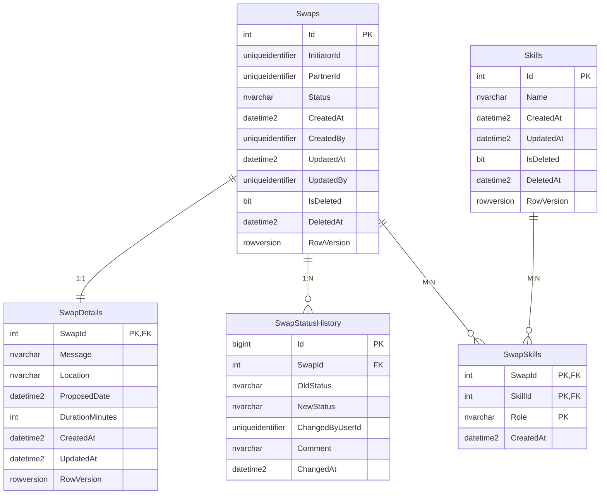
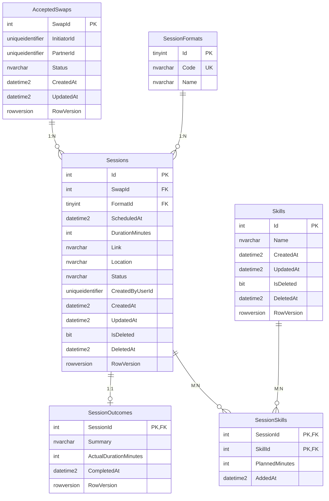
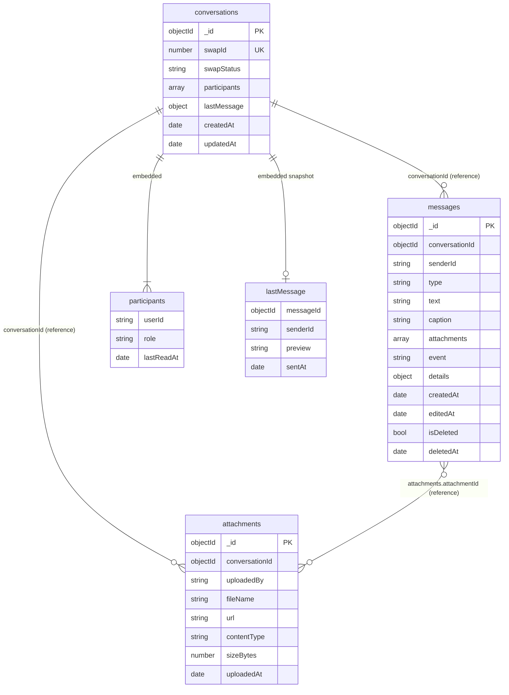

# ERD: піддомен Swaps

Піддомен складається з трьох API, кожен має власну базу. Між базами немає FOREIGN KEY: зв'язок забезпечують ідентифікатори (`SwapId`, `SkillId`, `UserId`) та локальні копії, які оновлюються подіями.

## Swaps (Проєкт №1, SQL Server, ADO.NET + Dapper), база QPQ_Swaps

## Sessions (Проєкт №2, SQL Server, EF Core), база QPQ_Sessions

## Messages (Проєкт №3, MongoDB), база QPQ_Messages

Документи в `messages` мають різні набори полів залежно від `type`: `text` (`text`, `editedAt`), `file` (`caption`, `attachments`), `system` (`event`, `details`).

## Зв'язки між базами

| Поле | Де використовується | Звідки береться | Як зв'язано |
|---|---|---|---|
| `UserId` (GUID) | `InitiatorId`, `PartnerId`, `CreatedBy`, `UpdatedBy`, `ChangedByUserId`, `CreatedByUserId`, `senderId`, `uploadedBy`, `participants.userId` | Identity (claim `sub`) | лише значення, без таблиці користувачів |
| `SkillId` | `Skills.Id` у Swaps і Sessions | Catalog | локальні копії `Skills`, оновлюються подією `SkillChanged` |
| `SwapId` | `AcceptedSwaps.SwapId` у Sessions, `conversations.swapId` у Messages | Swaps | локальні копії прийнятих обмінів, оновлюються подіями `SwapAccepted` і `SwapCompleted` |