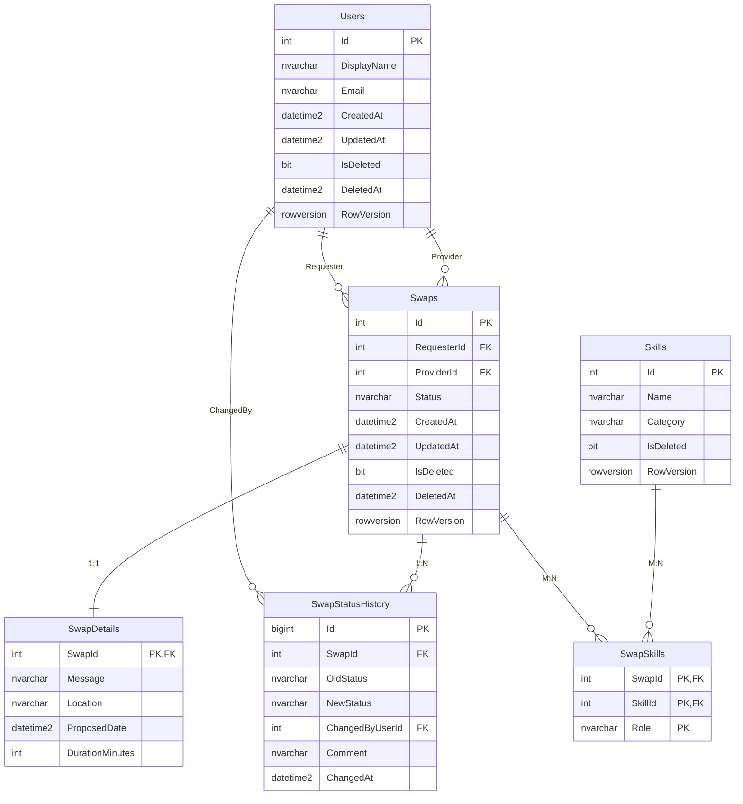

# ERD: Swaps (Проєкт №1, SQL Server)

```mermaid
erDiagram
    Users ||--o{ Swaps : "Requester"
    Users ||--o{ Swaps : "Provider"
    Users ||--o{ SwapStatusHistory : "ChangedBy"
    Swaps ||--|| SwapDetails : "1:1"
    Swaps ||--o{ SwapStatusHistory : "1:N"
    Swaps ||--o{ SwapSkills : "M:N"
    Skills ||--o{ SwapSkills : "M:N"

    Users {
        int Id PK
        nvarchar DisplayName
        nvarchar Email
        datetime2 CreatedAt
        datetime2 UpdatedAt
        bit IsDeleted
        datetime2 DeletedAt
        rowversion RowVersion
    }
    Skills {
        int Id PK
        nvarchar Name
        nvarchar Category
        bit IsDeleted
        rowversion RowVersion
    }
    Swaps {
        int Id PK
        int RequesterId FK
        int ProviderId FK
        nvarchar Status
        datetime2 CreatedAt
        datetime2 UpdatedAt
        bit IsDeleted
        datetime2 DeletedAt
        rowversion RowVersion
    }
    SwapDetails {
        int SwapId PK, FK
        nvarchar Message
        nvarchar Location
        datetime2 ProposedDate
        int DurationMinutes
    }
    SwapSkills {
        int SwapId PK, FK
        int SkillId PK, FK
        nvarchar Role PK
    }
    SwapStatusHistory {
        bigint Id PK
        int SwapId FK
        nvarchar OldStatus
        nvarchar NewStatus
        int ChangedByUserId FK
        nvarchar Comment
        datetime2 ChangedAt
    }
```