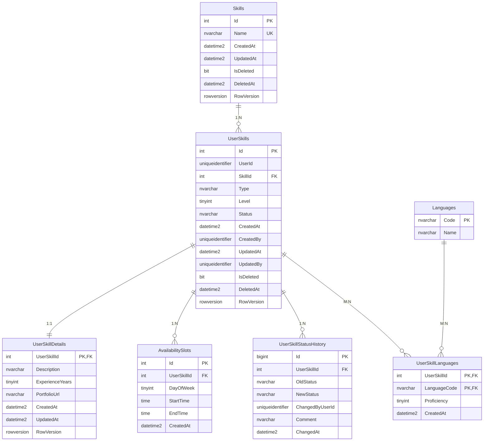
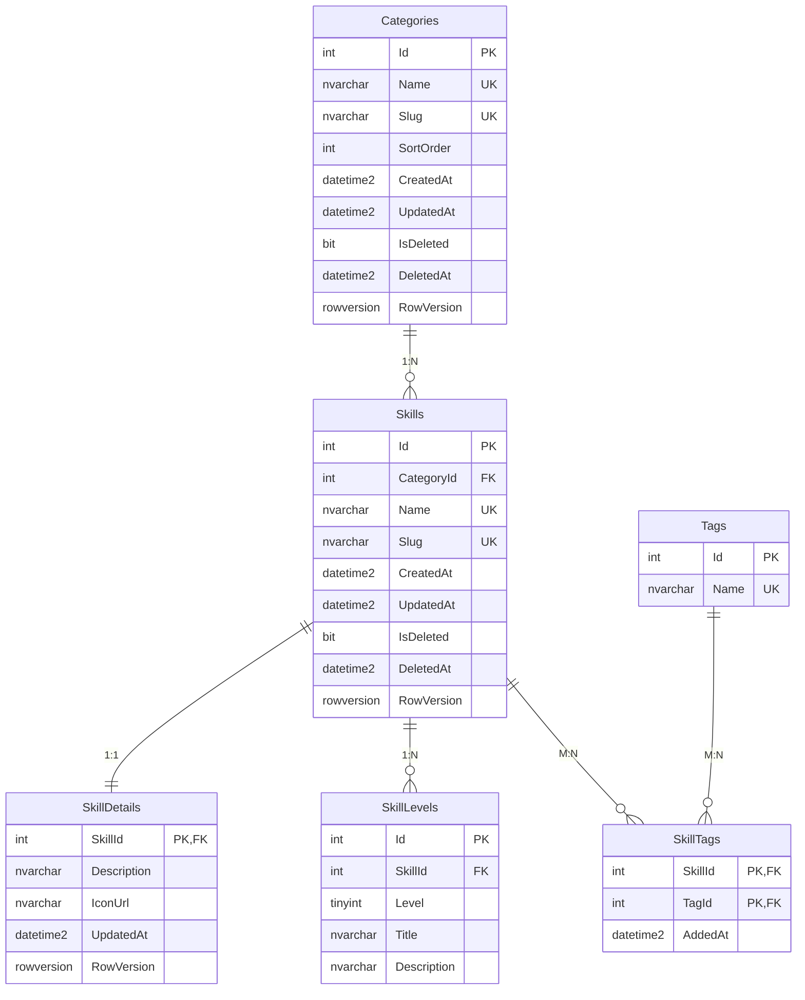
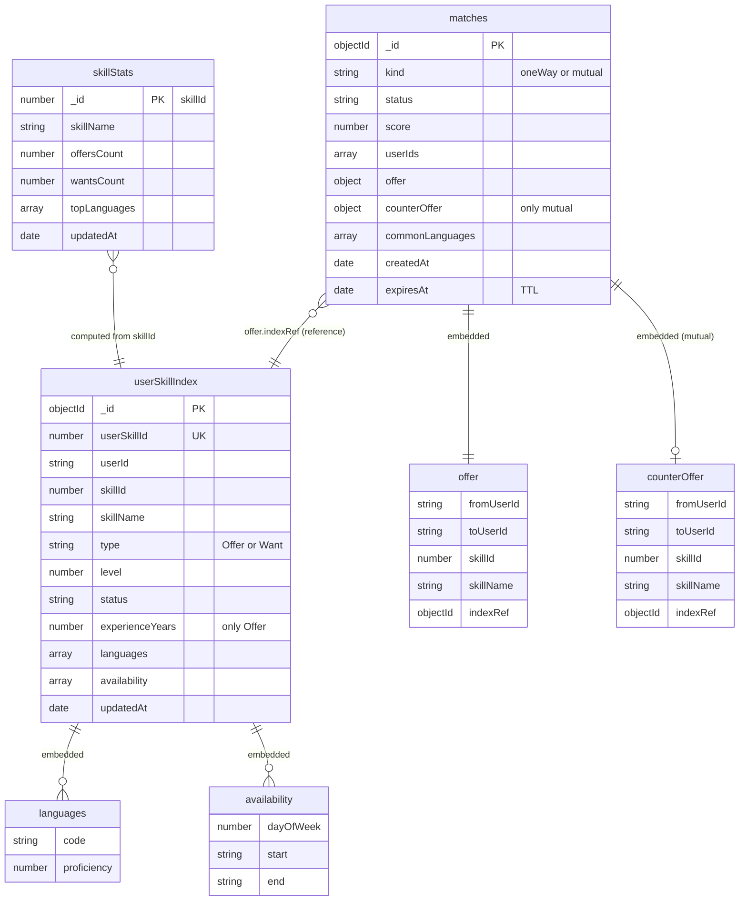
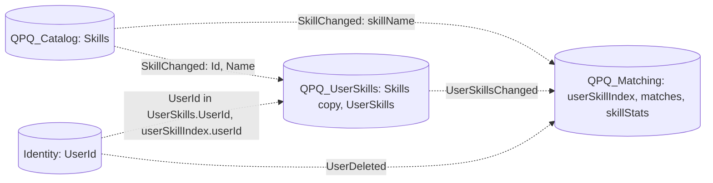

# ERD: піддомен Skills

Піддомен складається з трьох API, кожен має власну базу. Між базами немає FOREIGN KEY: зв'язок забезпечують ідентифікатори (`SkillId`, `UserId`) та локальні копії, які оновлюються подіями.

## UserSkills (Проєкт №1, SQL Server, ADO.NET + Dapper), база QPQ_UserSkills

## Catalog (Проєкт №2, SQL Server, EF Core), база QPQ_Catalog

## Matching (Проєкт №3, MongoDB), база QPQ_Matching

## Зв'язки між базами

Пунктирні зв'язки нижче є лише логічними посиланнями за ідентифікатором, без FOREIGN KEY. Поруч зберігаються копії полів.

